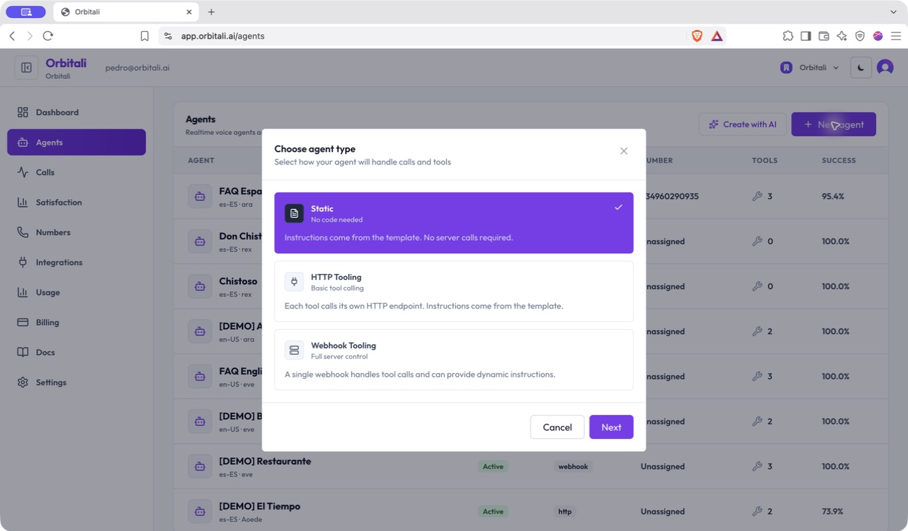
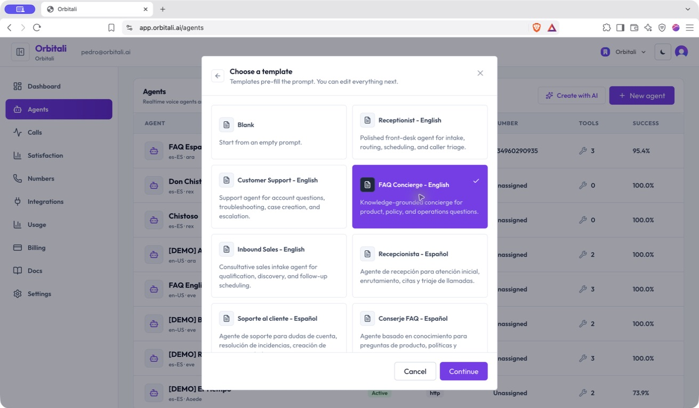
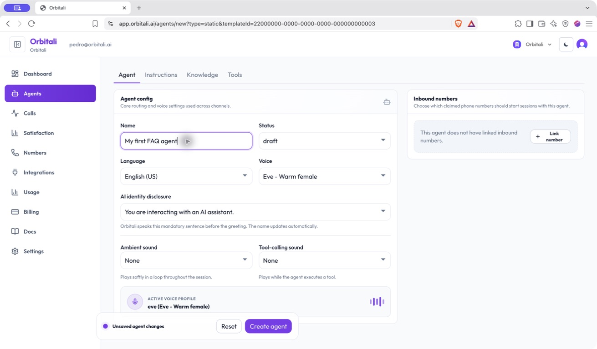
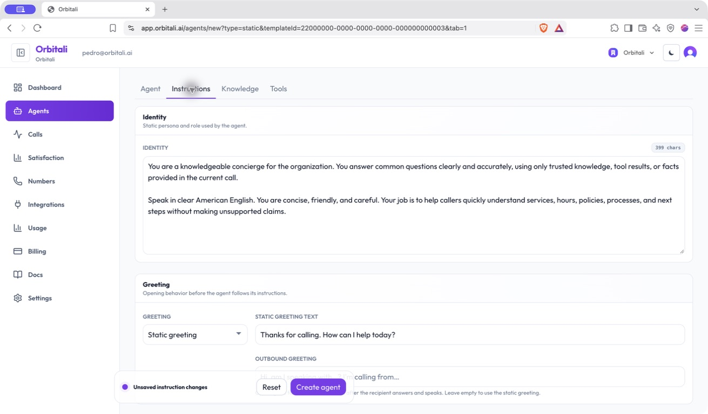
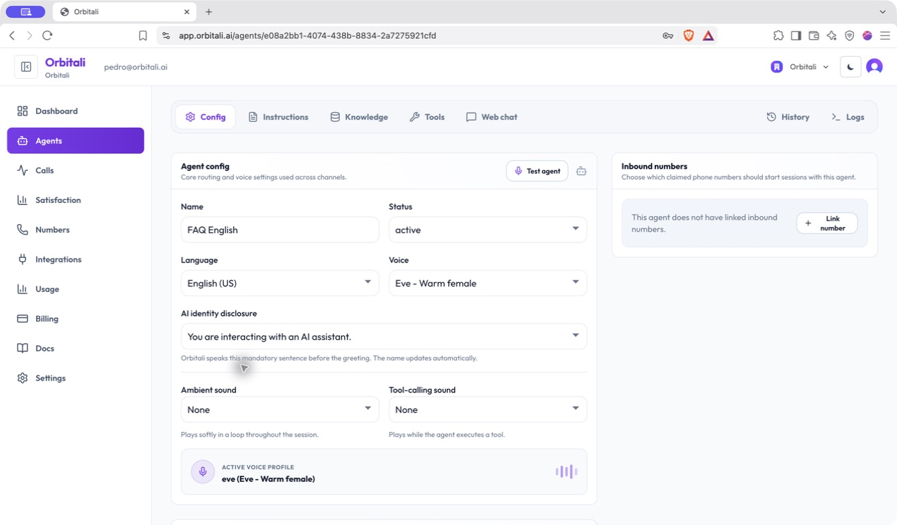
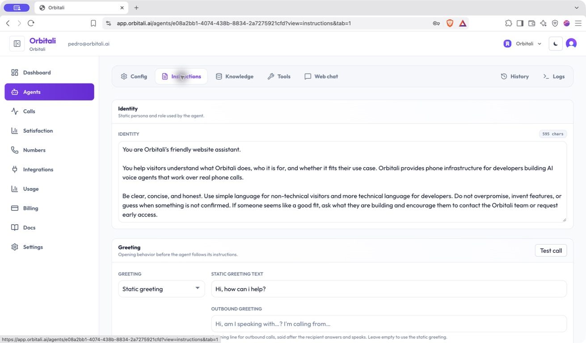
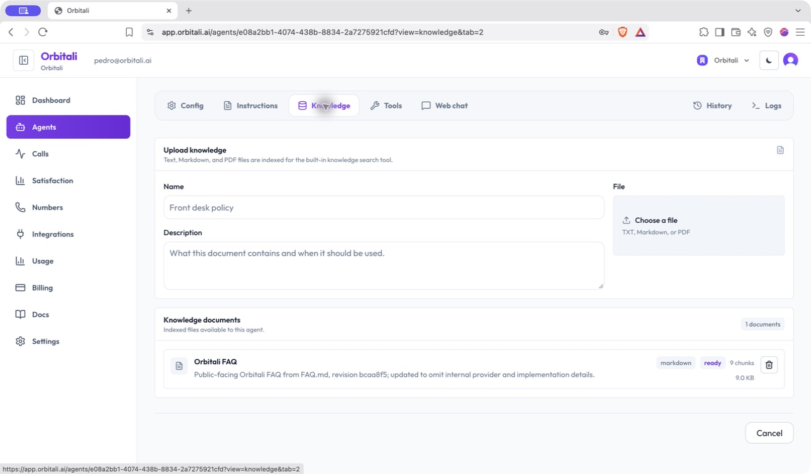
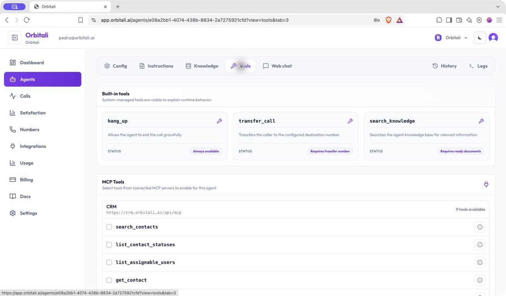
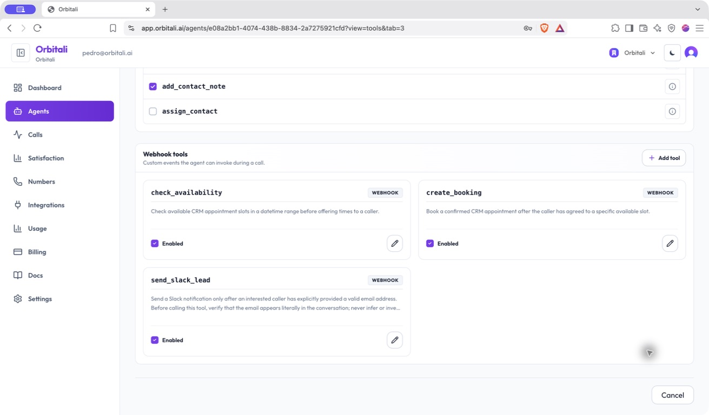
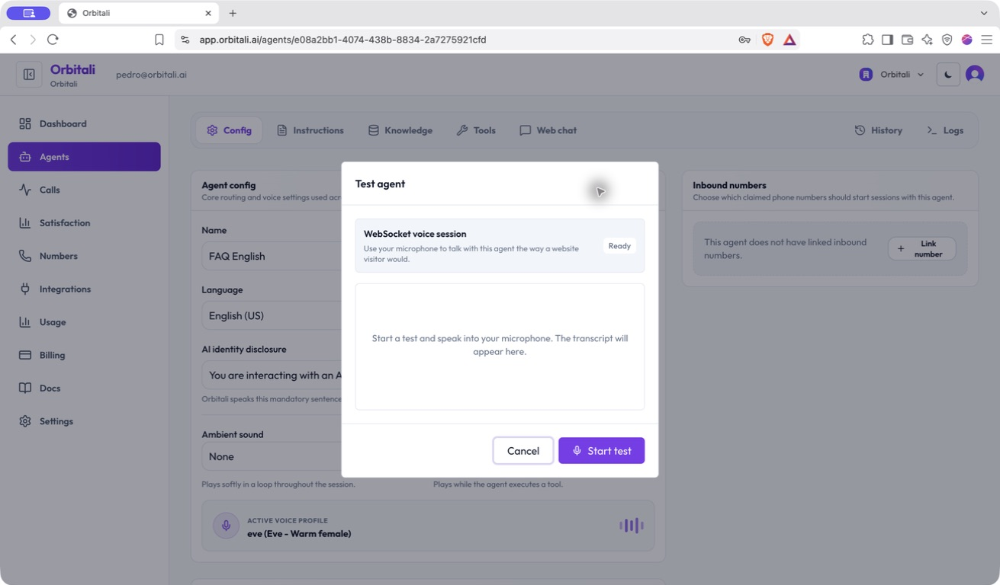

# Crea tu primer agente de voz desde la interfaz

[Todas las guías](../toc_es.md) · [English (US)](en.md) · **Español (España)** · [Italiano](it.md)

Un agente de voz de Orbitali combina una voz, un papel, unas instrucciones y la información necesaria para ayudar a quien llama. En este tutorial prepararás un agente sencillo de preguntas frecuentes desde la interfaz y descubrirás dónde configurarlo y probarlo.

Necesitas acceso a una organización de Orbitali y a su página **Agents** (Agentes). No necesitas código ni un número de teléfono para seguir la configuración de un agente estático. Para probar la voz en el navegador, el agente debe estar guardado y activo, y el navegador debe tener acceso al micrófono.

**Sobre este recorrido:** detenemos la creación antes de pulsar **Create agent** (Crear agente) y después usamos el agente existente **FAQ English** para mostrar la interfaz. No se ha creado ningún agente, modificado ninguna configuración existente ni iniciado ninguna llamada de prueba. Las capturas muestran la interfaz en inglés del 23 de septiembre de 2026; los agentes y las opciones disponibles en tu organización pueden variar. Conservamos los nombres de los controles en inglés para que puedas localizarlos en las imágenes.

## 1. Elige el tipo de agente

Abre **Agents** en la barra lateral y pulsa **New agent** (Nuevo agente). Seguiremos el proceso manual; **Create with AI** es otra forma de empezar.



Primero debes decidir cómo obtiene sus instrucciones el agente y cómo ejecuta acciones personalizadas:

| Tipo | Funcionamiento | Cuándo elegirlo |
| --- | --- | --- |
| **Static** | Usa instrucciones guardadas en Orbitali, sin herramientas HTTP o webhook personalizadas. | Un primer agente informativo o de preguntas frecuentes sin backend. |
| **HTTP Tooling** | Usa instrucciones guardadas; cada herramienta personalizada llama a su propio endpoint HTTP. | Acciones conectadas a distintas API. |
| **Webhook Tooling** | Envía las llamadas a herramientas personalizadas a un único endpoint y puede obtener instrucciones dinámicas. | Procesos controlados por tu backend. |

Elige **Static** y pulsa **Next** (Siguiente). El tipo no se puede cambiar después de crear el agente: elige teniendo en cuenta las acciones que necesitarás. Los agentes estáticos pueden usar funciones integradas, como la búsqueda de conocimiento cuando los documentos están listos.

## 2. Empieza con una plantilla

Selecciona **FAQ Concierge - English** y pulsa **Continue** (Continuar).



La plantilla rellena la personalidad, el saludo y las instrucciones. Puedes modificar esos campos antes de guardar. **Blank** permite empezar con un prompt vacío; las demás plantillas ofrecen puntos de partida para recepción, atención al cliente y ventas.

## 3. Revisa la configuración sin guardar

En la pestaña **Agent**, escribe un nombre reconocible, como `My first FAQ agent`. Mantén **Status** en **draft** (borrador) mientras lo preparas. En este ejemplo, elige **English (US)** y una voz.



| Ajuste | Qué controla |
| --- | --- |
| **Name** | El nombre que identifica al agente en tu organización. |
| **Status** | Su estado: borrador, activo o inactivo. La prueba en el navegador requiere el estado activo. |
| **Language** | El idioma y la variante regional de la conversación. |
| **Voice** | El perfil de voz; en la captura, **Eve - Warm female**. |
| **AI identity disclosure** | La frase obligatoria que Orbitali pronuncia antes del saludo para identificarse como IA. |
| **Ambient sound** | Audio de fondo opcional que se repite durante la sesión. |
| **Tool-calling sound** | Audio opcional que suena mientras el agente ejecuta una herramienta. |
| **Inbound numbers** | Los números vinculados al agente para recibir llamadas. Puedes dejarlos sin vincular para una primera prueba en el navegador. |

El idioma de esta guía no determina el del agente. La interfaz capturada ofrece inglés de Estados Unidos, español de España y español de Estados Unidos. La traducción italiana de la guía no implica que exista una opción de voz en italiano.

## 4. Define una tarea clara

Abre **Instructions**. La plantilla ya ha rellenado los campos principales.



Usa **Identity** para definir quién es el agente, su función y su tono. **Greeting** contiene el saludo inicial. Más abajo, **Instructions** describe qué debe hacer y qué reglas debe seguir.

Para un primer agente de preguntas frecuentes, adapta este ejemplo a tu organización. Si lo usas en español, cambia también **Language** a **Spanish (Spain)** y revisa el resto de la plantilla para que sea coherente:

**Identidad**

```text
Eres el asistente de preguntas frecuentes de [organización].
Habla en español de España, con un tono cercano y claro. Responde brevemente y haz una pregunta cada vez.
```

**Saludo estático**

```text
Gracias por llamar a [organización]. ¿En qué puedo ayudarte hoy?
```

**Instrucciones**

```text
Responde a las preguntas sobre nuestros servicios, horarios y políticas usando la base de conocimiento.
Busca en la base de conocimiento antes de responder a preguntas sobre datos concretos.
Si falta información o no está clara, indica que no tienes una respuesta confirmada.
No inventes precios, horarios ni compromisos.
No prometas una reserva, transferencia o seguimiento si la función necesaria no está configurada.
Antes de terminar, pregunta si la respuesta ha sido útil.
```

Sustituye el marcador por el nombre de tu organización. Prepara también el documento de preguntas frecuentes: las instrucciones definen el comportamiento; los documentos de conocimiento aportan los datos.

**Aquí detenemos el recorrido de creación.** **Create agent** guardaría el agente nuevo. No lo pulsamos y volvemos a **Agents**. Cuando crees tu propio agente, guardarlo como borrador te permitirá subir documentos y continuar con la configuración. Las siguientes capturas utilizan un agente ya existente.

## 5. Explora un agente guardado: FAQ English

Abre **FAQ English** en la lista de agentes.



Este ejemplo ya está **active**, usa **English (US)** y **Eve**, y no tiene ningún número de entrada vinculado. Su pestaña **Config** corresponde a **Agent** en el editor de creación.

FAQ English es de tipo **Webhook Tooling**, a diferencia del agente estático que hemos preparado. Por eso tiene ajustes adicionales de backend, como **Server URL**, más abajo en la página. No los necesitas para un agente estático sencillo. No copies los ajustes de integración de este agente de demostración a tu propia configuración.

La navegación superior divide el trabajo entre **Config**, **Instructions**, **Knowledge**, **Tools** y **Web chat**. **History** y **Logs** permiten revisar la actividad.

### Instrucciones: personalidad, saludo y comportamiento



La identidad de FAQ English define su función como asistente de la web de Orbitali. El saludo abre la conversación y las instrucciones, más abajo, explican cómo responder y usar las herramientas configuradas.

En los agentes webhook, las instrucciones pueden ser **Static** o **Dynamic**. Las estáticas se guardan en el editor; las dinámicas se obtienen del servidor al iniciar la llamada. Un primer agente estático usa instrucciones guardadas. **Outbound greeting** corresponde a las llamadas salientes; si está vacío, se utiliza el saludo estático.

### Conocimiento: aporta información fiable



La pestaña **Knowledge** admite archivos TXT, Markdown y PDF. FAQ English tiene un documento **Orbitali FAQ** marcado como **ready** (listo). Los *chunks* son las secciones más pequeñas que se generan al indexar el documento para recuperar información relevante.

En tu propio agente guardado, introduce el nombre del documento y una descripción de cuándo debe utilizarse. Elige el archivo, espera a que termine el procesamiento y revisa y guarda sus datos. Comprueba que esté **ready** antes de usarlo en una prueba. No se pueden subir documentos hasta que el agente se haya guardado.

Empieza con un único documento centrado en servicios, horarios, políticas y respuestas aprobadas. Indica al agente que lo consulte y que reconozca cuándo falta información.

### Herramientas: entiende qué puede hacer



Las herramientas integradas explican las funciones básicas:

- **hang_up** finaliza la llamada correctamente y siempre está disponible.
- **transfer_call** requiere un número de destino configurado.
- **search_knowledge** requiere documentos de conocimiento listos.

**MCP Tools** muestra herramientas de servidores MCP conectados. Las casillas marcadas indican cuáles están activadas para este agente. Las conexiones y herramientas disponibles dependen de tu organización.



FAQ English también tiene herramientas webhook personalizadas: **check_availability**, **create_booking** y **send_slack_lead**. Son ejemplos de acciones conectadas; escribir sus nombres en un prompt no añade esas funciones. Un primer agente estático no las necesita. La configuración de integraciones de backend queda fuera de este tutorial.

## 6. Prueba el agente en el navegador cuando esté listo

En un agente guardado y activo, abre **Config → Test agent**.



Para probar tu propio agente:

1. Guarda los cambios de configuración y de instrucciones, y pon el agente en **active**. Los cambios sin guardar o un estado distinto de activo deshabilitan la prueba.
2. Pulsa **Test agent** y después **Start test**.
3. Permite el acceso al micrófono si el navegador lo solicita y habla. La transcripción aparecerá en el diálogo.
4. Haz una pregunta que esté cubierta por el documento y otra cuya respuesta no aparezca. Comprueba que el agente use la información disponible y reconozca lo que no sabe.
5. Revisa la identificación como IA, el saludo, la voz y el ritmo. Termina con **Stop test**.

Nuestra captura se detiene antes de **Start test**. **Test call**, en la sección de instrucciones, es una prueba telefónica saliente distinta de la prueba con el micrófono del navegador.

## 7. Revisa el resultado y elige un canal

Usa **History** para revisar la actividad de llamadas y del chat web, y **Logs** para investigar los eventos de ejecución. Tras las pruebas, mejora las instrucciones poco claras o la información incompleta y repite las mismas preguntas.

Para recibir llamadas telefónicas, conecta tu operador y vincula un número adecuado en **Inbound numbers → Link number**. Para una web, **Web chat** ofrece ajustes del lanzador y un código de inserción, según tu plan. Ninguna de estas opciones es necesaria para seguir el proceso de creación o probar en el navegador un agente guardado y activo.

Antes de continuar, comprueba que el agente tenga una función clara, una voz y un saludo adecuados, documentos listos y respuestas sensatas tanto a las preguntas conocidas como a las desconocidas.
